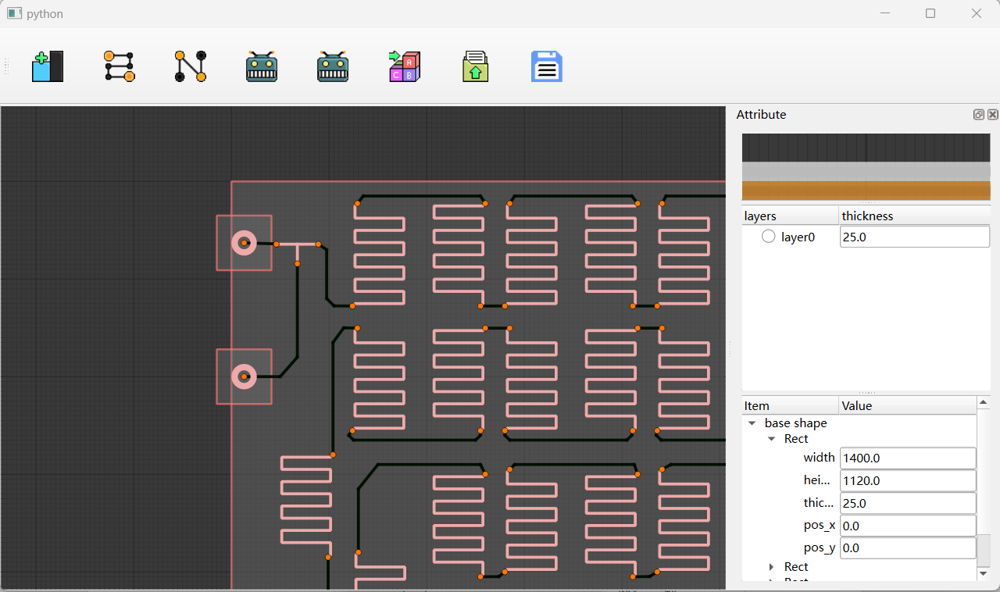

# Fluid Guider 
#### Requirements
- Python
- `PySide6` : https://pypi.python.org/pypi/pyside6/
- `CadQuery`: https://pypi.python.org/pypi/cadquery/
#### Not necessary (Projects that are ready to join but are not completed will be used)
- `numpy` : https://pypi.python.org/pypi/numpy/ (Used to build LBM simulations，Not yet adapted)
- `numba` : https://pypi.python.org/pypi/numba/ (Used to accelerate LBM simulations)
## introduce
This is a GUI for designing continuous flow reactors. It consists of three parts:
### Model maker
This is a tool for encapsulating reactor modules.Not published in this project. (Not the one in the folder src, it will be named `gui_make`)

The one in the folder src which named `src/model_make` is a place to put algorithms.

It will look like:

### Blueprint maker
This is a tool for building blueprints.Construct the connection between the reactors.

Go to the folder `src/gui_test` and run:
<pre>
    <code>python test.py</code>
</pre>
It looks like this:

### RealMap maker
It's a design tool for the layout and wiring of reactors.

Go to the folder `src/gui_real` and run:
<pre>
    <code>python test.py</code>
</pre>

or

In interface `Blueprint Maker` click:

`File`-->`To RealMap`(Ctrl+K)

(The prerequisite is that you need to create an MDI window first)

It looks like this:

## others
There is still a lot to be done.
### baseline
- Refine and publish `Model Maker` (Not the one in the folder src, it will be named `gui_make`)
- Refine and publish `Equation Maker`：Reactor connections can be recommended from the chemical equation.
- Refine and publish `LBM Simulation`.
#### Authors
*Song Hao*

DUT
